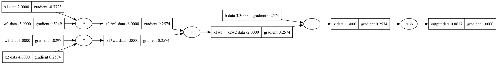
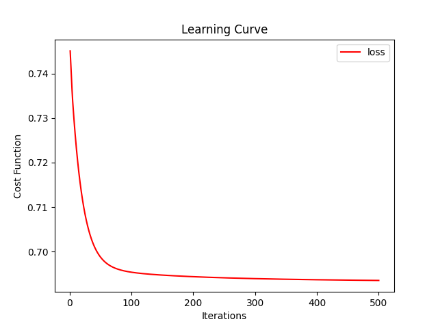

# Micronets

Micronets is a python framework for the simple implementation and training of deep neural networks. The project consists of a small auto-gradient engine module which implements back propagation through a DAG (Directed Acyclic Graph) and a module resembling the PyTorch/Tensorflow APIs to create and train dense neural networks on top of it.

The package also provides additional functionalities such as plotting of the training curve, make predictions and visualisation of computational graphs after training

## Installation 

```bash
pip install micronets
```

## Usage

### 1. Building Expressions Through Computational Graphs

```py
from micronets.autograd_engine import Value
from micronets.graph import draw

#inputs
x1 = Value(2.0,label='x1')
x2 = Value(4.0, label='x2')

#weights
w1 = Value(-3.0,label='w1')
w2 = Value(1.0,label='w2')

#bias
b = Value(3.3,label='b')

x1w1=x1*w1; x1w1.label='x1*w1'
x2w2=x2*w2; x2w2.label='x2*w2'

x1w1x2w2 = x1w1+x2w2; x1w1x2w2.label='x1w1 + x2w2'

z = x1w1x2w2 + b; z.label='z'

output = z.tanh(); output.label='output'

output.backward()

draw(output)
```
#### Output :


<br>
<br>

### 2. Neural Net Implementation

```py
from micronets.nn import DNN  # Dense Neural Network
from micronets.losses import binary_cross_entropy

xs = [
    [2.0, 3.0, -1.0],
    [3.0, -1.0, 0.5],
    [-0.5, -1.0, -1.0],
    [-1.0, -1.0, 0.5]
]

ys = [1.0, 0.0, 1.0, 0.0]

model = DNN(input_features=3, layers=[2,2,1], activations=['relu', 'relu', 'sigmoid'])  # creates model architecture

history, graph = model.train(X=xs, Y=ys, iterations=500, loss_function=binary_cross_entropy, learning_rate=0.1)  # trains network and stores loss function history and computational graph

predictions = model.predict([  # outputs predictions
    [2.0, -1.0, 3.5],
    [-1.0, -3.0, 0.5]
]) 

model.plot(history)  # plots learning curve
```
#### Output :


<br>

Additionally the `playground.ipynb` file demonstrates functionality through a more complex example along with its outputs.
<br>
<br>


## License

MIT
